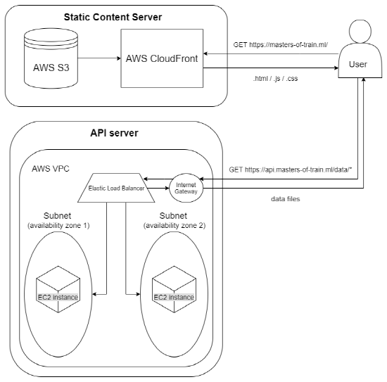

# 서울 메트로 혼잡도 뷰어
[공공데이터포털](https://www.data.go.kr/)에서 제공하는 지하철 역간 이동 인원 데이터를 이용하여 서울시 지하철의 각 구간별 혼잡도 통계를 시각적으로 확인할 수 있는 웹서비스이다.

## 실행
- Node.js
```
/* 확인된 node 버전: 10.15.3 */
npm start
```

- Docker
```
docker pull anny6159/masters-of-train:0.0.2

docker run -d -p 127.0.0.1:3000:3000 anny6159/masters-of-train:0.0.2
```

## 미리보기
#### 샘플 링크
>https://masters-of-train.ml/

#### 기본 화면

- 일반 뷰 상태에서는 서울시 1~9호선 지하철 노선도를 확인할 수 있다.
#### 혼잡도 뷰

- 혼잡도 뷰 상태에서는 각 구간(edge)별 혼잡도가 색상으로 표시된 노선도를 확인할 수 있다.
- 혼잡도는 해당 구간을 이동한 이용객 수를 산출하여 최솟값과 최댓값에 대해 정규화한 수치이다.
- 색상은 *빨강(매우 혼잡) - 노랑(보통) - 파랑(매우 쾌적)* 으로 그라데이션 된다.
#### 경로 탐색

- 혼잡도 뷰 상태에서 경로를 검색하게 되면 단순 최단거리 경로가 아닌 혼잡도 수치가 반영된 쾌적 경로가 표시된다.
- *TODO*: 혼잡도에 대한 weight값 조절을 통해 보다 유의미한 결과가 표시되도록 개선 필요.
## High availability server 구성(AWS)
### 서버 구조

- 정적인 리소스(.html/.css/.js 등)는 AWS S3와 CloudFront를 이용하여 전 세계 어느 지역에서나 빠르게 제공될 수 있도록 한다.
- 혼잡도 데이터와 같은 주요 데이터들은 별도의 api 서버를 두고 요청하여 가져오도록 한다. API 서버 또한 높은 가용성을 위해 둘 이상의 availability zone에 ec2 인스턴스를 두고 로드밸런서를 구성하였다.